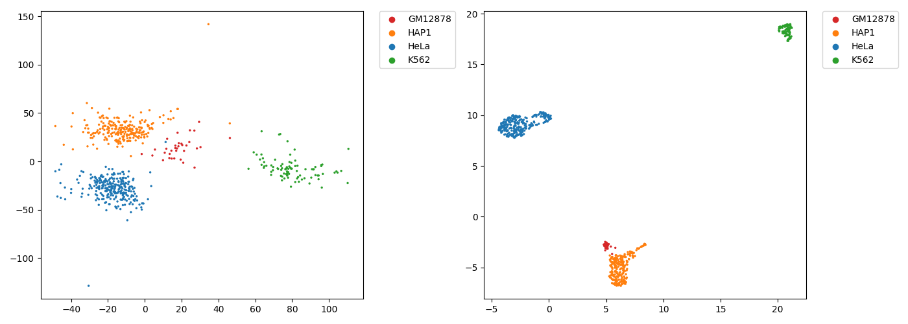
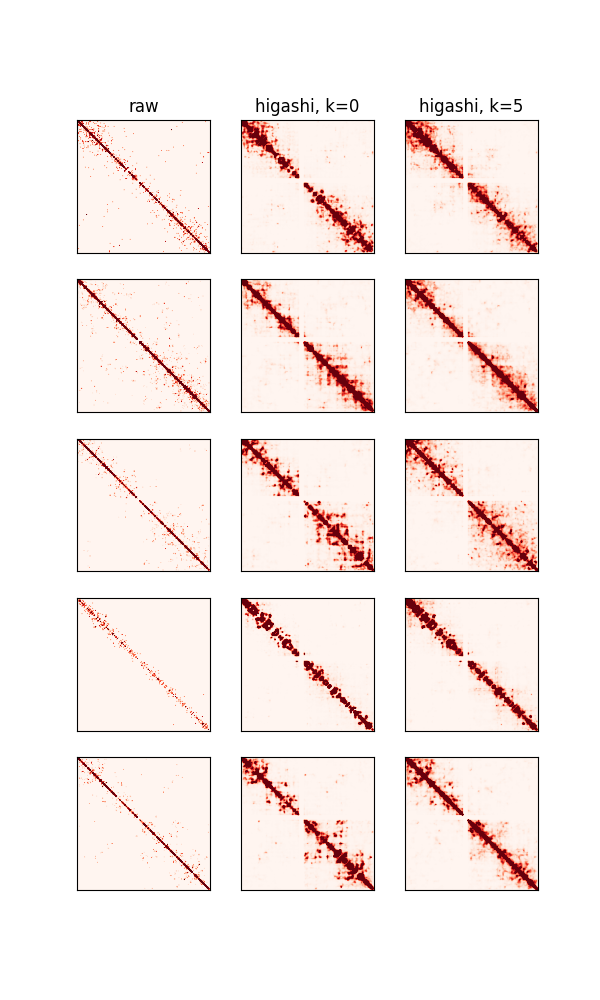

# Multiscale and integrative single-cell Hi-C analysis with Higashi
### Members
* 何彥南 (yen-nan ho), 110753202
* 張修誠 (Xiu-Cheng Chang),	110753165
* 陳偉瑄 (Wayne Chen), 110971020

### Demo 
You might provide an example commend or few commends to reproduce your analysis  
We reproduce example in Google Colaboratory(Colab), so you download the ipython file and run all.  
Python script in the ipython:
```
!python runincolab.py
```

## Folder organization and its related information

### docs
* Your presentation, 1102_bioinformatics_FP_studentID.ppt/pptx/pdf (i.e.,1102_bioinformatics_FP_556688.ppt), by **06.16**
* Any related document for the project
  * i.e., software user guide

### data
- Source
  - [GSE84920(NCBI)](https://www.ncbi.nlm.nih.gov/geo/query/acc.cgi?acc=GSE84920)
  - [hg19.chrom.sizes.txt](https://github.com/biogo/biogo/blob/master/feat/genome/human/hg19/hg19_cytoBand.txt.gz)
  - [cytoBand_hg19.txt](https://www.bing.com/ck/a?!&&p=fb88d8adf2973b1d62f106a27de877b200fdee63a71bf0e78df82dad6bed0851JmltdHM9MTY1NTMxNjI5NCZpZ3VpZD1iYTViYTc2OS1iMmY5LTQ4NDQtOWU0Zi0yOTlmNzM2MzZjYzcmaW5zaWQ9NTE0Mg&ptn=3&fclid=a8a23e00-ecd5-11ec-8568-8a03c052f1f3&u=a1aHR0cHM6Ly9oZ2Rvd25sb2FkLmNzZS51Y3NjLmVkdS9nb2xkZW5wYXRoL2hnMTkvZGF0YWJhc2UvY3l0b0JhbmQudHh0Lmd6&ntb=1)
- Format
  - ["higashi_v1" format](https://github.com/ma-compbio/Higashi/wiki/Input-Files)
- Size
  - [GSE84920(NCBI)-4.4G](https://www.ncbi.nlm.nih.gov/geo/query/acc.cgi?acc=GSE84920)
  - [hg19.chrom.sizes.txt-2KB](https://github.com/biogo/biogo/blob/master/feat/genome/human/hg19/hg19_cytoBand.txt.gz)
  - [cytoBand_hg19.txt-31KB](https://www.bing.com/ck/a?!&&p=fb88d8adf2973b1d62f106a27de877b200fdee63a71bf0e78df82dad6bed0851JmltdHM9MTY1NTMxNjI5NCZpZ3VpZD1iYTViYTc2OS1iMmY5LTQ4NDQtOWU0Zi0yOTlmNzM2MzZjYzcmaW5zaWQ9NTE0Mg&ptn=3&fclid=a8a23e00-ecd5-11ec-8568-8a03c052f1f3&u=a1aHR0cHM6Ly9oZ2Rvd25sb2FkLmNzZS51Y3NjLmVkdS9nb2xkZW5wYXRoL2hnMTkvZGF0YWJhc2UvY3l0b0JhbmQudHh0Lmd6&ntb=1)

### code
* Which packages do you use? 
  * original packages in the paper
- Analysis steps
  - **Step1**: Each cell and each genomic bin are represented as cell node and genomic bin node as a hypergraph. 
Each non-zero element in the single-cell contact map is modeled as a hyper-edge connecting the corresponding cell and the two genomic loci of that particular chromatin interaction (Fig. 1a). 
  - **step2**: Training a hypergraph neural network (NN) based on the constructed hypergraph (Supplementary Figs. 1 and 2).
  - **step3**: Cell nodes embedding vectors extraction from the trained hypergraph NN for downstream analysis. 
  - **step4**: To get more detailed and reliable characterization of 3D genome features, use the trained hypergraph NN to impute single-cell Hi-C contact maps with the flexibility to incorporate the latent correlations among cells to enhance overall imputation. 
  - **step5**: With several new computational strategies, we reliably compare A/B compartment scores and TAD-like domain boundaries across individual cells to promote the analysis of cell-to-cell variability of these large-scale 3D genome features and its implication in gene transcription. 

### results
#### Which part of the paper do you reproduce?
##### embedding + PCA/UMAP

##### imputation

#### Any improvement or change by your package?
 No, but from our results,  `k-neighbour` in higashi  is not make any difference
## References
* [ma-compbio/Higashi: single-cell Hi-C, scHi-C, Hi-C, 3D genome, nuclear organization, hypergraph (github.com)](https://github.com/ma-compbio/Higashi#:~:text=As%20a%20computational%20framework%20for%20scHi-C%20analysis%2C%20Higashi,the%20cell%20node%20and%20the%20genomic%20bin%20node.)
* Related publications
 ```
@article {Zhang2020multiscale,
	author = {Zhang, Ruochi and Zhou, Tianming and Ma, Jian},
	title = {Multiscale and integrative single-cell Hi-C analysis with Higashi},
	year={2021},
	publisher = {Nature Publishing Group},
	journal = {Nature biotechnology}
}
```
